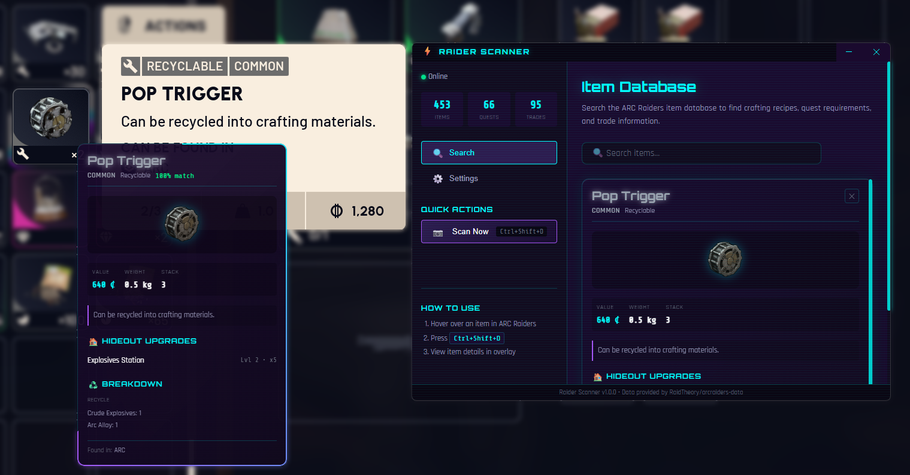

# ⚡ Raider Scanner

**Your Ultimate ARC Raiders Companion**

Real-time item scanning and information overlay for ARC Raiders players.

---

[Features](#-features) • [Installation](#-installation) • [How to Use](#-how-to-use) • [Settings](#%EF%B8%8F-settings) • [FAQ](#-frequently-asked-questions)

<strong>📸 View Screenshot</strong>

---

## 🎯 What is Raider Scanner?

**Raider Scanner** is a companion app for **ARC Raiders** players. It runs alongside your game and provides instant information about any item you hover over.

**No more alt-tabbing to look up items!** Simply press a hotkey while hovering over an item in the game, and an overlay will show you everything you need to know.

---

## ✨ Features

### 🔍 Smart Item Scanning

Press a hotkey while hovering over any item to instantly see its details:

- **Automatic detection** - No need to position anything manually
- **High accuracy** - Optimized for ARC Raiders' tooltips
- **Smart matching** - Finds the right item even if reading isn't perfect

---

### 📊 Complete Item Database

Access comprehensive information about every item in ARC Raiders:

| Information                | Description                                 |
| -------------------------- | ------------------------------------------- |
| **Item Name & Rarity**     | Full name with color-coded rarity indicator |
| **Crafting Uses**          | What items can be crafted using this item   |
| **Quest Requirements**     | Which quests need this item                 |
| **Trade Information**      | Where to buy/sell and at what prices        |
| **Hideout Upgrades**       | Which hideout stations need this item       |
| **Recycle/Salvage Values** | What you get from recycling or salvaging    |

---

### 🎮 Non-Intrusive Overlay

The overlay is designed to **never interfere with your gameplay**:

- ✅ **Click-through** - Your mouse clicks go through to the game
- ✅ **Doesn't steal focus** - The game stays in the foreground
- ✅ **Always on top** - Works even in fullscreen mode
- ✅ **Auto-hide** - Disappears automatically after a few seconds

---

### ⚡ Instant Search

Don't want to scan? Use the built-in **search bar** to quickly find any item:

- Type part of an item name
- Results appear instantly
- Click to view full item details

---

## 📥 Installation

### Step 1: Download

Click the download button below to get the latest version:

Or go to the [Releases Page](https://github.com/emanuele-toma/raider-scanner/releases) and download `Raider-Scanner-Setup-x.x.x.exe`.

---

### Step 2: Install

1. Double-click the downloaded `.exe` file
2. Follow the installation wizard
3. Launch Raider Scanner from your Start Menu or Desktop

---

### Step 3: First Time Setup (Calibration)

Before scanning works, you need to **calibrate** the app to recognize your game's tooltip color:

1. **Launch ARC Raiders** and Raider Scanner
2. In Raider Scanner, go to the **Calibration** tab
3. Click **"Start Calibration"**
4. **Hover over an item in the game** to show a tooltip
5. Press the **capture hotkey** (shown on screen)
6. A screenshot appears - **click on the tooltip background color**
7. Done! The app is now calibrated for your game

> **💡 Tip:** You only need to calibrate once. The setting is saved automatically.

---

## 🎮 How to Use

### Basic Scanning

1. **Play ARC Raiders** as normal
2. When you see an item you want info about, **hover over it** to show the tooltip
3. **Press `Ctrl + Shift + D`** (or your custom hotkey)
4. The overlay appears with all item information!

---

### Overlay Controls

| Action                     | Default Hotkey     |
| -------------------------- | ------------------ |
| **Scan item**              | `Ctrl + Shift + D` |
| **Close overlay**          | `Ctrl + Shift + C` |
| **Pause/Resume countdown** | `Ctrl + Shift + P` |

> **💡 Tip:** When you scan a new item while the overlay is open, it automatically closes and scans the new item.

---

## ⚙️ Settings

Access settings from the main Raider Scanner window.

| Setting             | Description                    | Default            |
| ------------------- | ------------------------------ | ------------------ |
| **Scan Hotkey**     | Key to scan items              | `Ctrl + Shift + D` |
| **Close Hotkey**    | Key to close overlay           | `Ctrl + Shift + C` |
| **Pause Hotkey**    | Key to pause/resume countdown  | `Ctrl + Shift + P` |
| **Auto-hide Delay** | How long overlay stays visible | 5 seconds          |
| **Overlay Opacity** | How transparent the overlay is | 100%               |

---

## ❓ Frequently Asked Questions

<strong>Is this allowed? Will I get banned?</strong>

Raider Scanner only takes screenshots and reads text from them - it does not interact with the game in any way. It's similar to using a second monitor to look up information. However, always check the game's Terms of Service to be safe.

<strong>The scan isn't detecting my tooltips!</strong>

Make sure you've completed the calibration process. Go to the Calibration tab and follow the steps. If it still doesn't work, try recalibrating.

<strong>The wrong item is being detected!</strong>

This can happen occasionally. Try scanning again with the tooltip fully visible on screen.

<strong>How do I update the item database?</strong>

The item database is included with the app. To get the latest items, download the newest version of Raider Scanner from the [releases page](https://github.com/emanuele-toma/raider-scanner/releases).

---

## 📄 License

AGPL License - See [LICENSE](LICENSE) file for details.

---

Made with ❤️ for the ARC Raiders community

⭐ **Star this repo if you find it useful!** ⭐

